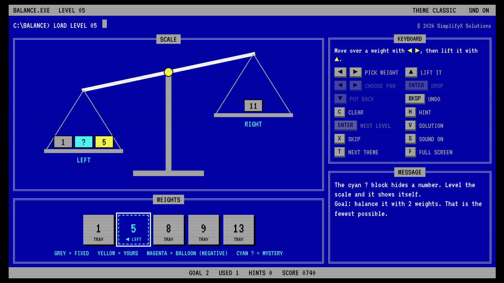
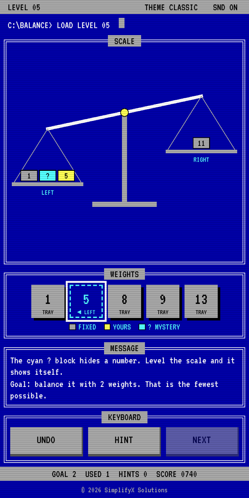

# Balance the Scale

**A calm, free number puzzle with a retro DOS look.** Put weights on the scale until both sides are level. No ads, no accounts, no timers, nothing to buy.

**▶ Play now: [iravindu.github.io/balance-the-scale](https://iravindu.github.io/balance-the-scale/)**

Version **1.0** · Released **October 3, 2026** · Works on desktop, tablet and phone

---

## Why I made this

We all live complicated, fast-paced lives, and we all need an escape sometimes. It could be during a hard day at work, or even in the middle of the night.

I've been a gamer since my childhood (not a hardcore one), and I wanted a game that isn't complicated. These days even mobile games make you jump through hoops: energy bars, daily quests, pop-ups and a shop around every corner. I wanted one where I don't have to pay anything to enjoy a calm, quiet moment. We all deserve that.

That's how **Balance the Scale** came alive. From today onwards, it's all yours!

Your feedback is welcome: **[simplifyx.net@gmail.com](mailto:simplifyx.net@gmail.com)**

*Ravindu Abeygunasekara, SimplifyX Solutions*

---

## How to play (quick tutorial)

### The goal
The scale has a **LEFT** and a **RIGHT** pan. Some grey blocks are already sitting on them, so the scale tips to one side. Below the scale is a tray of **your weights**. Put some of them on the pans so that **both sides weigh exactly the same**. When the beam goes level and turns green, you've won the level.

### Your first level, step by step
1. Look at the scale. Say the left pan has **12** and the right pan has **4**. The right side is **8** lighter.
2. Look at your tray: **2**, **4** and **6**.
3. You need 8 more on the right. **6 + 2 = 8**, so put the 6 and the 2 on the **RIGHT** pan.
4. The scale balances: 12 on each side. Done!

### Putting a weight on a pan
- **Phone or mouse:** tap or click a weight. It cycles **TRAY → LEFT → RIGHT → back to TRAY**. You can also drag it straight onto a pan.
- **Keyboard:** use **◄ ►** to pick a weight, **▲** to lift it, **◄ ►** to choose a pan, and **ENTER** to drop it. **▼** puts it back.
- To take a weight off, tap or click it on the pan, or keep tapping it in the tray until it says TRAY.

### Blocks you will meet
| Block | What it means |
|---|---|
| **Grey** | Fixed. It is already on the scale and can't be moved. |
| **Yellow** | Yours. A weight you placed from the tray. |
| **Cyan "?"** (from level 4) | Mystery. A fixed block with a hidden number. Balance the scale and it shows itself. |
| **Magenta balloon** (from level 8) | Negative weight. A balloon on a pan makes that side *lighter*. |

### Points
Every level has a **GOAL**: the fewest weights that can solve it. You don't have to hit it, but it's worth a bonus.

| | Points |
|---|---|
| Balance the scale | +100 |
| Use no more weights than the GOAL | +50 bonus |
| Use one weight more than the GOAL | +20 bonus |
| Each hint | −25 |
| Show the solution or skip | 0 for that level |

You always get at least 10 points for a solved level. There is no timer and no way to lose. Take your time.

### Stuck?
Press **HINT** (or **H**). The weight you should move next starts blinking, and the message tells you where it goes. You can ask again as often as you like. On desktop you can also press **V** twice to see the full solution, or **X** to skip a level.

---

## Controls

| Action | Keyboard | Mouse | Phone |
|---|---|---|---|
| Place a weight | ◄ ► then ▲, ◄ ►, ENTER | Click the weight (right-click goes backwards) or drag it onto a pan | Tap the weight, or drag it onto a pan |
| Take a weight off | ▼ | Click it on the pan | Tap it on the pan |
| Undo | Backspace | UNDO | UNDO |
| Hint | H | HINT | HINT |
| Next level (after a win) | ENTER | NEXT LEVEL | NEXT |
| Clear the level | C | CLEAR | |
| Show the solution | V, then V again | SOLUTION | |
| Skip the level | X | SKIP | |
| Sound on/off | S | SND in the menu bar | SND in the menu bar |
| Change colours | T | THEME in the menu bar | THEME in the menu bar |
| Full screen | F | FULL SCREEN | |

---

## Features

- **Five colour themes:** Classic blue, Slate, Amber, Phosphor green and LCD.
- **Soft, satisfying sounds**, all made live in your browser: wooden thocks, a ratchet tick as the beam moves, and a little bell when you win. Sound starts only after your first tap or key press.
- **Same puzzles for everyone:** level 7 is the same level 7 on every device.
- **Your progress stays on your device.** Level, score and theme are saved in your browser's local storage. Nothing is sent anywhere.
- **Respects "reduce motion"** settings on your device.

## Run it yourself

It's a single file with no build step and no dependencies. Download `index.html` and open it in any modern browser. The retro font (VT323) loads from Google Fonts; without internet it falls back to Courier New.

## Version history

- **v1.0** (October 3, 2026): first public release.

## Licence

[GPL-3.0](LICENSE) © 2026 SimplifyX Solutions (Ravindu Abeygunasekara). Free to play, share, copy and change. If you share a changed version, it must stay open source under the same licence and keep the copyright notice.

